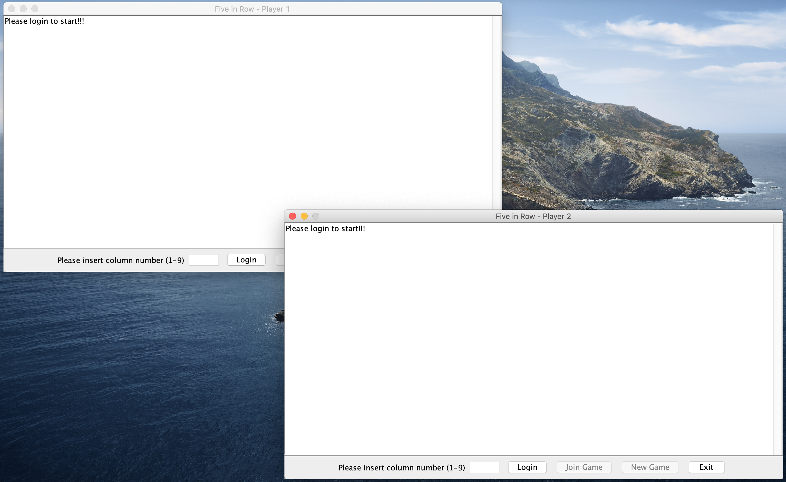
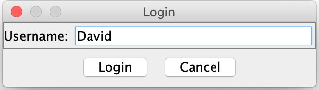
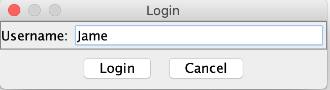
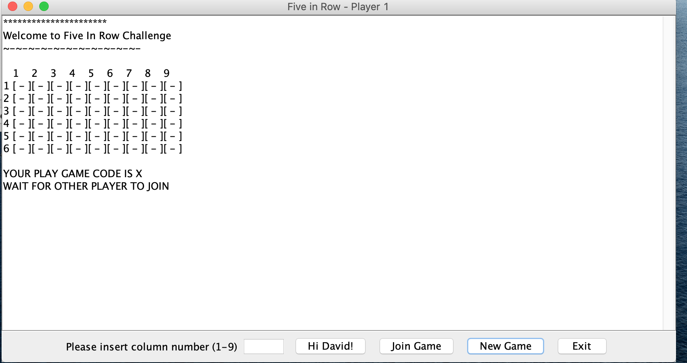
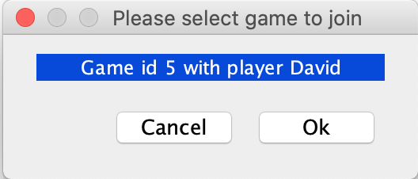

# FiveInRowChallenge

This game was developed using following technologies:

1. Spring boot
2. Websocket
3. Java 8

## GameServer

The source code of game server is located at GameServer directory
#### Deployment

Move to GameServer directory and run the following command in terminal to deploy the Game server.

```
cd GameServer

./mvnw

```

#### Packaging as jar

To build the final jar and optimize the FiveInRowChallenge application for production, run:

```

mvn clean verify


```

To ensure everything worked, run:

```

java -jar target/*.jar


```

Then navigate to [http://localhost:8080](http://localhost:8080) in your browser.

#### Testing

To launch your application's tests, run:

```
./mvnw verify
```

## GameClient

The source code of game client is located at GameClient directory
#### Deployment

Move to GameClient directory and run the following command in terminal to pack the Game client as jar file.

```
cd GameClient

mvn clean install

```

To ensure everything worked, run:

```

java -jar target/*.jar


```

## Play game

The game starts with two windows which illustrate for 2 game player. The board game size is configurable at the 
application properties of game server. The default size is 6x9 and default win count is 5.

<p align="center">
<align="center">

#### Step 1. Player 1 and 2 login
Player needs to be login to play game. Player clicks the Login button.

<p align="center">
<align="center">
  
A login window will pop up. Player input player name. If the player name is not found, it will be automatically registered to the game server. Player 1 username and player 2
username have to be different. 

<p align="center">
<align="center">
  
#### Step 2. Player creates new game
Player is allowed to create a new game. Please click on the **New Game** button. A new game is then loaded and shown in the game window. Assume that player 1 (David) creates a new game. A new game is loaded as shown in the image below.

<p align="center">
<align="center">

#### Step 3. Player joins game.
Player is also allowed to join exisiting game that was created by other player. A new pop up window will shown with a list of existing games with the first player name. Player will select the game that player want to join and click **OK**. The image below illustrates a player 1 joins a game that was already created by player 2.

<p align="center">
<align="center">

#### Step 4. Input move
When a game has two joined players, it can be started. Player can create a move by inputing the column number in the Move text box as follows.

<p align="center">
<align="center">

Press **Enter** to mave a move. Whenever one of two players makes a move, a new game status will be shown on the game screen to notify the player.
